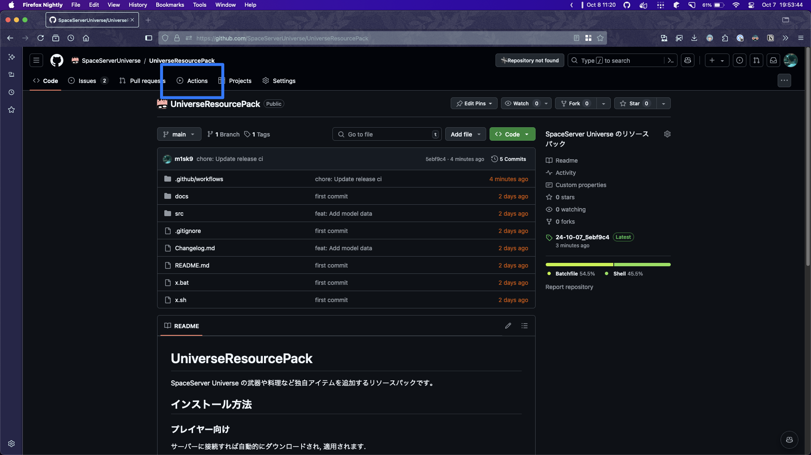
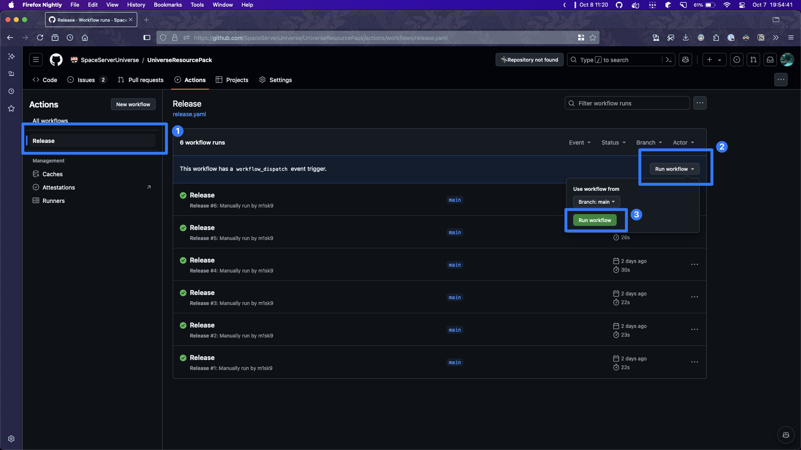

# UniverseResourcePack - リリース方法

UniverseResourcePack はバージョニングをしていません. 運営や開発者がリソースパックを追加してからリリースしたいときに自由にリリースできます.

## リリース方法

1. [Actions](https://github.com/SpaceServerUniverse/UniverseResourcePack/actions) をクリックします.

    

2. `Run workflow` をクリックします.

    

3. リリースに成功すると自動的に `日付_commit-hash` の形式でリリースされた UniverseResourcePack が作成されます.
4. サーバーが自動的に最新の UniverseResourcePack をダウンロードするため, プレイヤーのリソースパックは最新のものに更新されます.

> [!TIP]
>
> 再起動は必要ありませんが, プレイヤーが最新のリソースパックを適用していない場合は再接続する必要があります.
